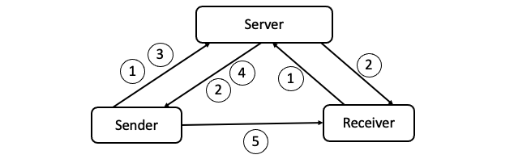

## **Objective**

In this hands-on activity, you will implement a simple chat application to develop an intuition and comfort with cryptography and network security.

## **Starter Code**

Designing a chat application from scratch is time consuming and arduous. In order to simplify this activity, partially working starter code files are available for you. The instructor will go over the instructions to setup the code during the start of the class.

There are two starter files - `sender.py` and `receiver.py`. The `sender.py` source file will be used for all sender specific code and `receiver.py` for all receiver specific code. Note that, in real applications, both sending and receiving are handled by the same program. We are using two source files for simplicity.

## **Chat Protocol**

The figure below demonstrates the traffic (message) flow and the chat application protocol. A central server acts as the arbitrator for ensuring secure communications. Note that messages 1 - 3 are already implemented. During this activity, you will focus on implementing messages 4 and 5.

### **Implemented**

**Message 1 (Login Request)** - Each client sends a login request to the server. The request is a POST request with url `/login` and JSON data `{'username': <username>, 'password': <password>}`. This functionality is implemented in `sender.py` and `receiver.py`.

**Message 2 (Login Response)** - The server responds to a successful login request with status code `200` and JSON data `{'token': <token>}`. Note that `<token>` is a session token that must be used for subsequent requests to the server. This functionality is implemented in `sender.py` and `receiver.py`. 

**Message 3 (Chat Request)** - The sender sends a request to the server to obtain a receiver's details. The request is a POST request with url `/userinfo` and JSON data `{'username': <username>, 'token': <token>, 'receiver': <receiver name>}`. This functionality is implemented in `sender.py`.

### **To Implement**

**Message 4 (Chat Response)** - The server responds to the chat request with status code `200` and JSON data `{'ip_addr': <receiver ip>, 'secret': <secret>, 'senderinfo': <encrypted sender info>}`. The encrypted sender information is the JSON data `{'username': <sender name>, 'ip_addr': <sender ip>, 'secret': <secret>}` encrypted by the receiver's session token. The `secret` can be used by the sender and receiver for exchanging confidential chat messages.

**Message 5 (Chat Message)** - The sender sends a message to the receiver encrypted using the `secret`. Only the receiver is able to decrypt and read this message. 

## **Grading**

The grading for this activity is straightforward.

* You will receive 100 points for attempting a solution with your project group.
* You will receive 0 points if you don't show up or don't attempt a solution.